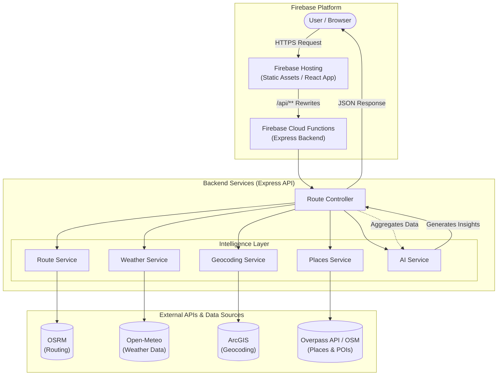

# System Architecture: Wayvue

## Overview
Wayvue is a trip intelligence application that provides drivers with real-time insights about their route, including weather, road conditions, and recommended stops. It follows a serverless architecture using **Firebase**.

## Component Breakdown

### 1. Client (Frontend)
- **Technology**: React, Vite, TailwindCSS.
- **Deployment**: Hosted on **Firebase Hosting**.
- **Role**: Renders the UI, maps (Leaflet), and handles user interaction. It communicates with the backend via a single unified API endpoint.

### 2. Services (Backend)
- **Technology**: Node.js, Express.
- **Deployment**: Deployed as a **Firebase Cloud Function** logic.
- **Entry Point**: `exports.api` in `index.js`.
- **Role**: Orchestrates data fetching, aggregates results, and generates the final trip intelligence report.

### 3. Services (Internal)
These modular services handle specific domains of data:

- **RouteService**: Calculates the driving route, distance, and duration using OSRM.
- **WeatherService**: Fetches real-time and forecast weather data along the route path using Open-Meteo.
- **PlacesService**: Identifies stops (food, fuel, views) using OpenStreetMap data via the Overpass API.
- **GeocodingService**: Converts city names to coordinates (and vice-versa) using ArcGIS.
- **AIService**: A logic layer that synthesizes raw data (weather, traffic, fuel) into human-readable "insights" and "fun moments".

### 4. External Data Sources
Wayvue relies on open and free-tier compatible APIs:
- **OSRM**: Logic for driving directions.
- **Open-Meteo**: High-precision weather data.
- **ArcGIS**: Geocoding services.
- **Overpass API**: Querying OpenStreetMap nodes for places of interest.

## Data Flow
1.  **Request**: User enters "Start" and "End" in the React app.
2.  **Route**: The backend fetches the route geometry.
3.  **Sampling**: The route is sampled at fixed intervals (e.g., every 15 miles).
4.  **Enrichment**:
    -   Weather is fetched for each sample point.
    -   Nearby places are queried for samples.
5.  **Analysis**: The `AI Service` processes all this data to generate a summary, driving tips, and warnings.
6.  **Response**: The frontend receives a JSON object containing the route line, weather markers, stops, and the text analysis.
